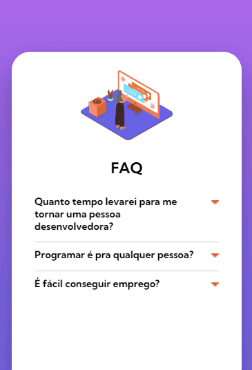
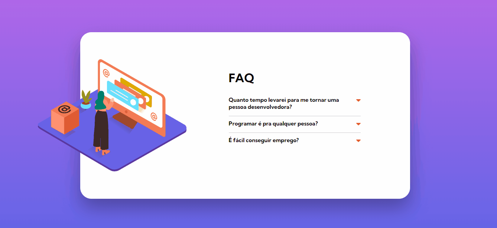

  

<h1 align='center'> FAQ accordion card </h1>

	
	
	

_Para a versão em Português, clique [aqui](#portuguese)._ 

### Topics

- [Project description](#project-description)

- [Technologies used](#technologies-used)

- [What I learned](#what-I-learned)

- [Access the Project](#access-the-project)

## Project description

A mini project of a fictitious FAQ section about web programming. This project is one of the challenges proposed on the [Frontend Mentor](https://www.frontendmentor.io/home) site. The challenge is to recreate the project without the guidance of a design tool (figma) and making it as close as possible to the requested one. 

[The challenge](https://www.frontendmentor.io/challenges/faq-accordion-card-XlyjD0Oam)

## Technologies used

  
  
  

## What I learned

- Introduction to javascript (different types of scopes, primitive data types...);
- Declaring variables;
- Create basic functions so that the exchange happens when the user clicks on the section;
- The kinds of loops and iterations.

## Access the Project

You can [access the project here](https://bo83dev.github.io/faq-programacao/) 

Mobile:

Desktop:

Tablet:

<h1 align='center'> FAQ accordion card </h1>

	
	
	

### Tópicos 

- [Descrição do projeto](#descrição-do-projeto)

- [Tecnologias utilizadas](#tecnologias-utilizadas)

- [O que aprendi](#o-que-aprendi)

- [Acesse o projeto](#acesse-o-projeto)

## Descrição do projeto 

Um mini projeto de uma seção de FAQ fictícia sobre programação web. Esse projeto é um dos desafios propostos no site [Frontend Mentor](https://www.frontendmentor.io/home) e o desafio é recriar o projeto sem o auxílio de ferramentas de design (figma) deixando-o mais próximo possível do solicitado. 

[O desafio](https://www.frontendmentor.io/challenges/faq-accordion-card-XlyjD0Oam)

## Tecnologias utilizadas

  
  
  

## O que aprendi

- Introdução básica ao javascript (sobre os diferentes tipos de escopos, tipos de dados primitivos...);
- Como declarar variáveis;
- Criar funções básicas para que a troca aconteça quando o usuário clicar na seção;
- Alguns tipos de loops e interações.

## Acesse o projeto

Você pode [acessar o projeto aqui](https://bo83dev.github.io/faq-programacao/) 

Mobile:

Desktop:

Tablet:

Developed with 🧡 by me!  [Carol Vilar](https://www.linkedin.com/in/carolinebarbosavilar/)
